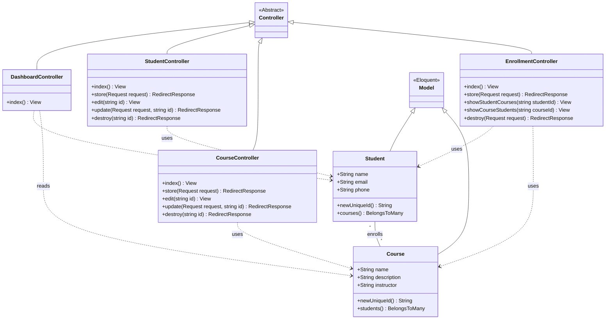

# 🏗️ Class Diagram (Arsitektur Backend) — SkillHub

Dokumen ini menampilkan arsitektur backend aplikasi **SkillHub** menggunakan pendekatan **MVC (Model-View-Controller)**. Diagram ini menjelaskan alur interaksi antar komponen, terutama Controller dan Model.

---

## 🗺️ Architecture Overview

> **Catatan:** Ganti placeholder di bawah ini dengan screenshot Class Diagram dari Mermaid Chart.

---

## 🗂️ **Mermaid Source Code**

<strong>🔍 Klik untuk melihat Source Code Mermaid</strong>

---

## 📝 Penjelasan Detail Komponen

### 1. **Controller Layer (Logika Bisnis)**

Ada empat Controller utama pada arsitektur SkillHub:

* **StudentController** & **CourseController**
  Menangani operasi CRUD (Create, Read, Update, Delete).

* **EnrollmentController**
  Bertugas mengelola proses pendaftaran siswa ke kelas, termasuk:

  * Validasi agar tidak terjadi pendaftaran duplikat
  * Penghapusan relasi Student–Course

* **DashboardController**
  Mengambil data agregat seperti total siswa, total kelas, dan statistik lain untuk ditampilkan pada dashboard.

---

### 2. **Model Layer (Eloquent ORM)**

Model di Laravel berfungsi sebagai representasi tabel database.

#### ✔ Menggunakan Trait `HasUuids`

Model **Student** dan **Course** memiliki mekanisme generator UUID v7 otomatis untuk primary key.

#### ✔ Relasi Many-to-Many

Mengimplementasikan relasi:

* `$student->courses()` → kelas yang diambil siswa
* `$course->students()` → daftar peserta pada kelas tertentu

Relasi ini menggunakan pivot table `course_student` di database.

---

## 📦 Ringkasan Interaksi

| Komponen       | Tipe     | Tanggung Jawab                                       |
| -------------- | -------- | ---------------------------------------------------- |
| **Controller** | Logic    | Menerima request, validasi, memanggil Model          |
| **Model**      | Data     | Representasi tabel + relasi + aturan data            |
| **View**       | Tampilan | Menampilkan hasil akhir ke pengguna (Blade Template) |

